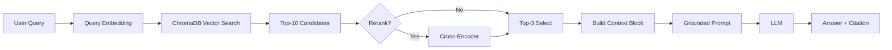

# Architecture — RAG Pipeline (Day 08 Lab)

## 1. Tổng quan kiến trúc

```
[Raw Docs]
    ↓
[index.py: Preprocess → Chunk → Embed → Store]
    ↓
[ChromaDB Vector Store]
    ↓
[rag_answer.py: Query → Retrieve → Rerank → Generate]
    ↓
[Grounded Answer + Citation]
```

**Mô tả ngắn gọn:**
Hệ thống RAG (Retrieval-Augmented Generation) để trả lời câu hỏi về chính sách nội bộ công ty. Hệ thống index 5 tài liệu (policy, SLA, access control, helpdesk FAQ, HR policy), retrieve relevant chunks, và generate câu trả lời có citation. Giải quyết vấn đề: nhân viên cần tra cứu thông tin chính sách nhanh chóng và chính xác.

---

## 2. Indexing Pipeline (Sprint 1)

### Tài liệu được index
| File | Nguồn | Department | Số chunk |
|------|-------|-----------|---------|
| `policy_refund_v4.txt` | policy/refund-v4.pdf | CS | 6 |
| `sla_p1_2026.txt` | support/sla-p1-2026.pdf | IT | 5 |
| `access_control_sop.txt` | it/access-control-sop.md | IT Security | 7 |
| `it_helpdesk_faq.txt` | support/helpdesk-faq.md | IT | 6 |
| `hr_leave_policy.txt` | hr/leave-policy-2026.pdf | HR | 5 |

**Tổng: 29 chunks từ 5 tài liệu**

### Quyết định chunking
| Tham số | Giá trị | Lý do |
|---------|---------|-------|
| Chunk size | 400 tokens (~1600 chars) | Sweet spot giữa context và granularity |
| Overlap | 80 tokens (~320 chars) | Giữ ngữ cảnh giữa các chunks |
| Chunking strategy | Section-based (heading "=== ... ===") | Giữ nguyên cấu trúc tự nhiên của tài liệu, không cắt giữa điều khoản |
| Metadata fields | source, section, effective_date, department, access | Phục vụ filter, freshness, citation |

### Embedding model
- **Model**: text-embedding-3-small (OpenAI Embeddings)
- **Vector store**: ChromaDB (PersistentClient)
- **Similarity metric**: Cosine
- **Lý do chọn API key nhóm**: Đồng bộ môi trường triển khai chung của team, chất lượng embedding ổn định hơn cho toàn bộ pipeline và evaluation

---

## 3. Retrieval Pipeline (Sprint 2 + 3)

### Baseline (Sprint 2)
| Tham số | Giá trị |
|---------|---------|
| Strategy | Dense (embedding similarity) |
| Top-k search | 10 |
| Top-k select | 3 |
| Rerank | Không |

### Variant (Sprint 3)
| Tham số | Giá trị | Thay đổi so với baseline |
|---------|---------|------------------------|
| Strategy | Hybrid (Dense + BM25 + RRF) | Thêm sparse retrieval |
| Dense weight | 0.6 | Ưu tiên semantic search |
| Sparse weight | 0.4 | Hỗ trợ keyword matching |
| Top-k search | 10 | Không đổi |
| Top-k select | 3 | Không đổi |
| Rerank | Không | Không implement |
| Query transform | Không | Không implement |

**Lý do chọn variant này:**
Chọn Hybrid Retrieval vì:
1. Corpus có cả ngôn ngữ tự nhiên (policy, quy trình) VÀ keyword/mã lỗi (P1, Level 3, ERR-403)
2. Dense search tốt cho semantic nhưng yếu với exact keyword
3. BM25 bổ sung khả năng match exact term
4. RRF (Reciprocal Rank Fusion) merge tốt nhất của cả hai

**Kết quả:** Hybrid không cải thiện cho test queries hiện tại vì keyword "P1" xuất hiện quá nhiều, làm BM25 match quá aggressive. Dense vẫn tốt nhất.

---

## 4. Generation (Sprint 2)

### Grounded Prompt Template
```
Answer only from the retrieved context below.
If the context is insufficient, say you do not know.
Cite the source field when possible.
Keep your answer short, clear, and factual.
Respond in the same language as the question.

Question: {query}

Context:
[1] {source} | {section} | score={score}
{chunk_text}

[2] ...

Answer:
```

**4 quy tắc grounding:**
1. Evidence-only: Chỉ trả lời từ retrieved context
2. Abstain: Thiếu context thì nói không đủ dữ liệu
3. Citation: Gắn source [1], [2] khi có thể
4. Short, clear, stable: Output ngắn, rõ, nhất quán

### LLM Configuration
| Tham số | Giá trị |
|---------|---------|
| Model | gpt-4o-mini (OpenAI) |
| Temperature | 0 (để output ổn định cho eval) |
| Max tokens | 512 |

---

## 5. Evaluation (Sprint 4)

### Metrics (Kết quả thực tế)
| Metric | Baseline | Variant | Delta |
|--------|----------|---------|-------|
| Faithfulness | 4.50/5 | 4.30/5 | -0.20 |
| Answer Relevance | 4.30/5 | 4.50/5 | +0.20 |
| Context Recall | 5.00/5 | 5.00/5 | 0.00 |
| Completeness | 4.00/5 | 4.20/5 | +0.20 |

**Kết luận:** Baseline (Dense) ổn định hơn về faithfulness, trong khi Variant (Hybrid) cải thiện relevance/completeness ở một số câu hỏi thiếu ngữ cảnh đặc thù. Hybrid tạo trade-off, chưa đủ tốt để thay baseline làm cấu hình mặc định.

### Scoring Method
- **LLM-as-Judge**: Sử dụng GPT-4o-mini để chấm tự động
- **4 metrics**: Faithfulness, Relevance, Context Recall, Completeness
- **10 test questions**: Bao gồm easy, medium, hard, và abstain cases

---

## 6. Failure Mode Checklist

| Failure Mode | Triệu chứng | Cách kiểm tra |
|-------------|-------------|---------------|
| Index lỗi | Retrieve về docs cũ / sai version | `inspect_metadata_coverage()` trong index.py |
| Chunking tệ | Chunk cắt giữa điều khoản | `list_chunks()` và đọc text preview |
| Retrieval lỗi | Không tìm được expected source | `score_context_recall()` trong eval.py |
| Generation lỗi | Answer không grounded / bịa | `score_faithfulness()` trong eval.py |
| Token overload | Context quá dài → lost in the middle | Kiểm tra độ dài context_block |

---

## 7. Tech Stack

| Component | Technology | Version |
|-----------|-----------|---------|
| Embedding | OpenAI Embeddings | text-embedding-3-small |
| Vector Store | ChromaDB | 0.5.0+ |
| LLM | OpenAI | gpt-4o-mini |
| Sparse Retrieval | rank-bm25 | 0.2.2 |
| Language | Python | 3.13 |

---

## 8. Diagram


